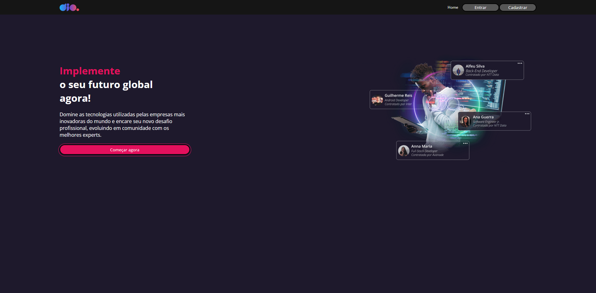
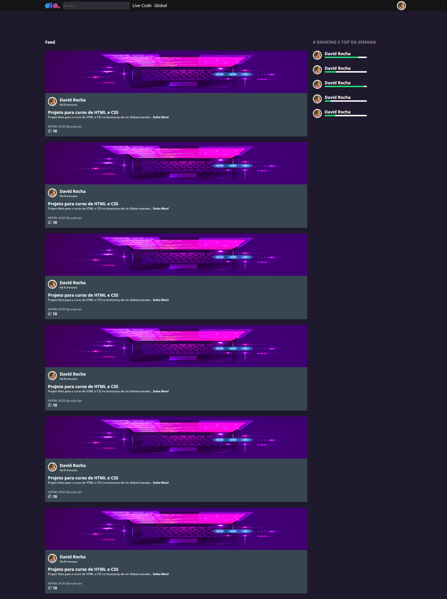

# Dio - Clone

In order to deepen my studies in React.js, I copied 3 pages from the DIO website.

The knowledge I acquired that stands out the most are: styling components and creating a dynamic style through 'styled-components', navigating pages through 'react-router', performing authentication to define when to show certain content.

